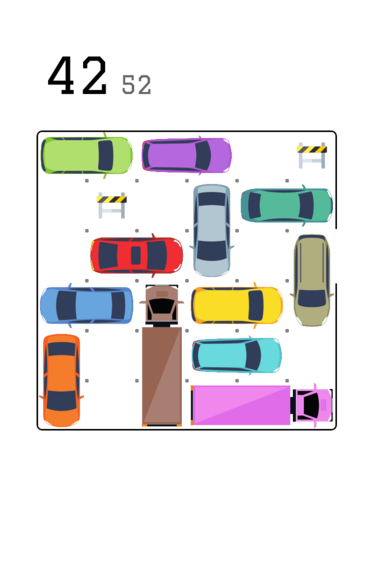
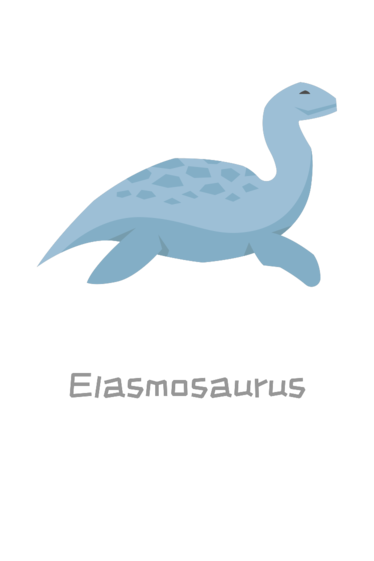
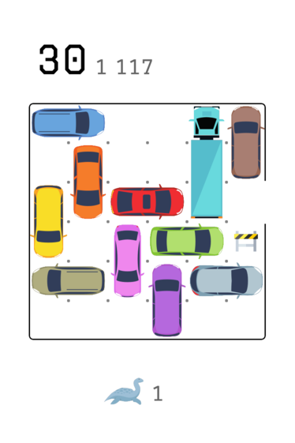
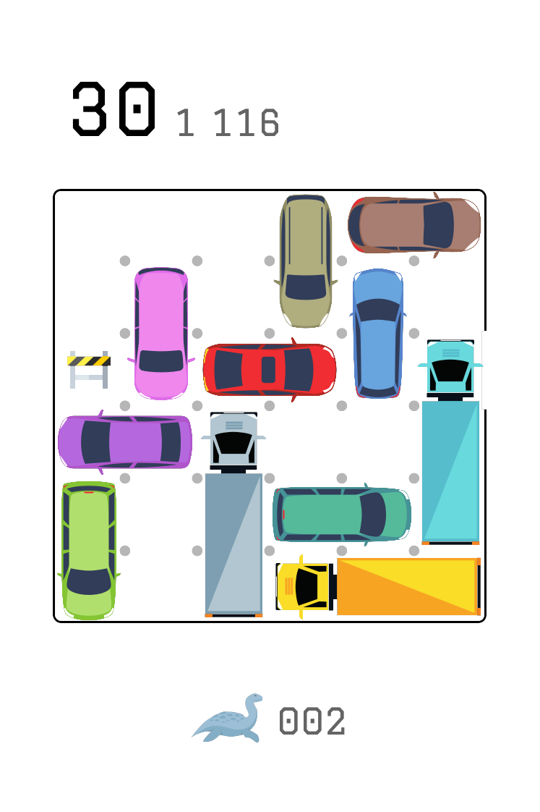
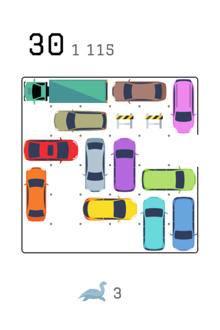
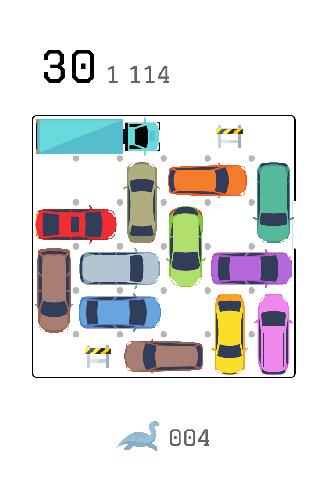

# Dino-Rush
Dino-Rush allow to create custom problems deck of any size and any difficulty for the game rush-hour.

The dinosaur theme, used as a mean to differentiate multiple deck, has been chosen quite arbitrary because dinosaur are cool!

# Usage
## Dependancy installation
```sh
$ pip3 install --upgrade --user cairosvg pillow
```

## Graphics generation
This needs to be done once initialy and everytime you change the svg graphics or add one:
```sh
$ ./generate_graphics.py
```

## Standalone card
Makes a random card show up:
```sh
$ ./mkcard.py
```

You can specify a difficulty by chosing a number of move required (must be <= 60):
```sh
$ ./mkcard.py --level 42
```



## Deck generation
### Standard deck
```sh
$ ./generate_deck.py nb_move index_puzzle icon n
$ ./generate_deck.py 30 1114 elasmosaurus 4
```
 - `nb_move` and `index_puzzle` represent the index of the 'highest' puzzle that will be in the deck.
   - `nb_move` is the number of move require to solve the puzzle. By lack of a better metrics this is used to represent the difficulty.
   - `index_puzzle`, indicate the rank of the puzzle amongst all the one for nb\_move
 - `icon` represent the svg file that will be used to identified the deck. Two files are required
   - `icon.svg`, a svg of 1/3 x 1/3 inch page properties
   - `icon-big.svg`, a svg of 2 x 2 inch page properties
   - ['stegosaurus', 'parasaurolophus', 'elasmosaurus'] are the provided available preset.
 - `n` is the number of puzzle produced.

Result of the above command:








### Customized constraint
When generating a deck, puzzle are checked to be playable with a normal physical game (i.e. maximum 0 wall, 12 car, 4 truck).

Those {min,max}×{wall,car,truck} value can be tweak. For example
 - if you bought the limo extension, use `--mintruck 5 --maxtruck 5` to generate a specific deck with 5 truck for every puzzle.
 - if you handcraft 2 bariers (which I recommend as it is quite easy and open quite a lot of puzzle from the database), use `--maxwall 2` to generate deck with 0 up to 2 wall per puzzle.

## Printed result
I ordered 3 printd decks of 36 cards (which makes 35 cards * 2 puzzle plus a 'readme' card) on [printerstudio](https://www.printerstudio.com) using the 'bridge' size card.
I printed the puzzle from the top of the database (most number of move needed to solve) with the following parameters:
```sh
./generate_deck.py 60 1 stegosaurus 70 --maxwall 2
./generate_deck.py 46 8 parasaurolophus 70 --maxwall 2
./generate_deck.py 44 29 elasmosaurus 70 --maxwall 2
```

For a total of 210 quite hard problem !!

I bet this is way too much and I won't have them all solved for maybe years, but I wanted enough decks to have my own custom collection.

~reception and thus photo here in a few week~

# Limitation known
The size of the input svg in the repo and some constant in the code are specificaly chosen and hardcoded, as the generated image will be printed on a specific sized card.

I didn't reuse/code a solver as I feel that having the solution printed on the back of the card is pretty useless. This also free the place and allow me to print twice more problems per deck !

The puzzle who require more than 12 car (rare) or more than 4 truck (I haven't looked if it is even possible in the database) are dismissed as they are not playable with the physical game.

The database, and thus, the puzzles generated can contains up to two 'wall' cells: a 1x1 blocker that cannot move. Those are not dismissed as that would trim a lot of interresting puzzle and I think they are quite easy to DIY...

# Credits
See dedicated file [here](credits.md).

The credits are separated to allow the automatic rendering of a specific card with credits on the deck.
